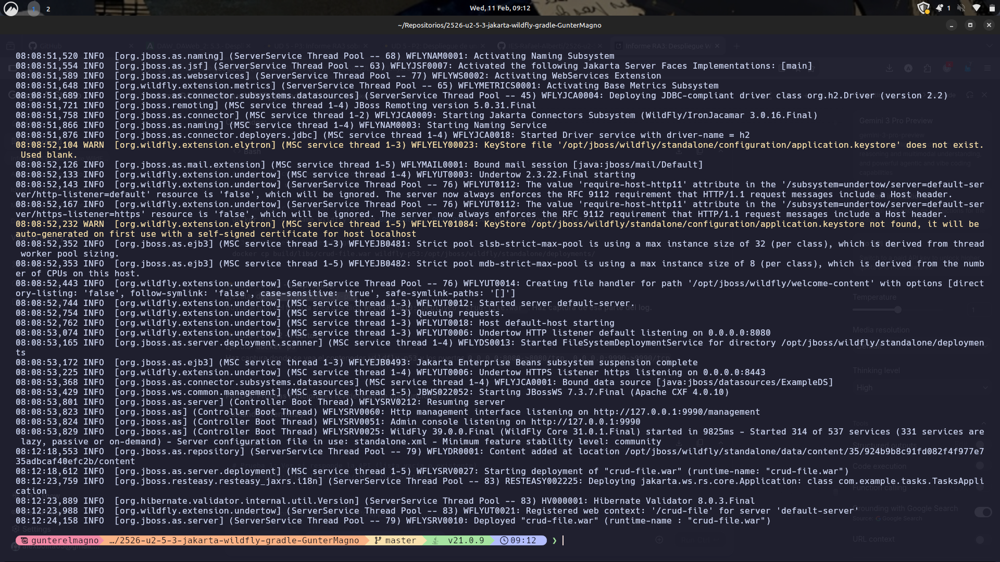
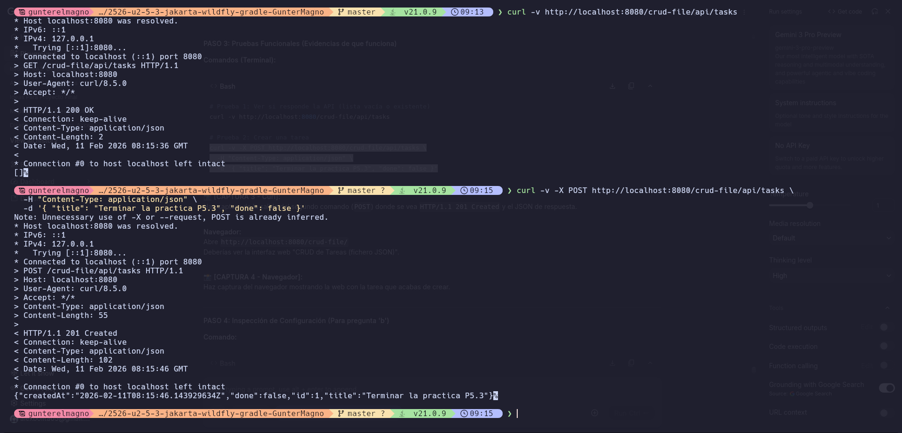
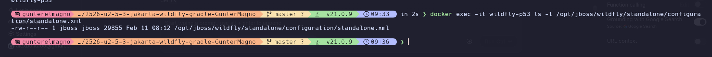
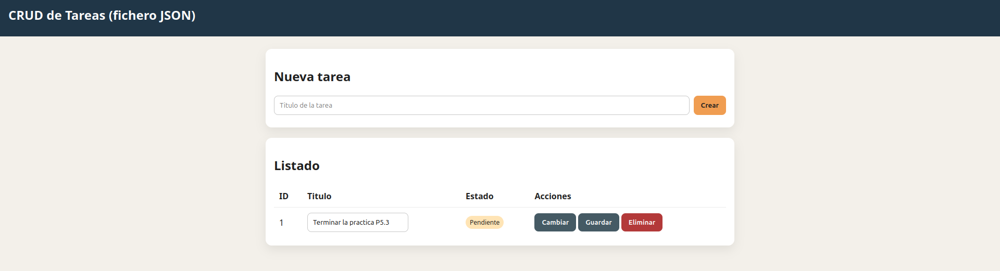
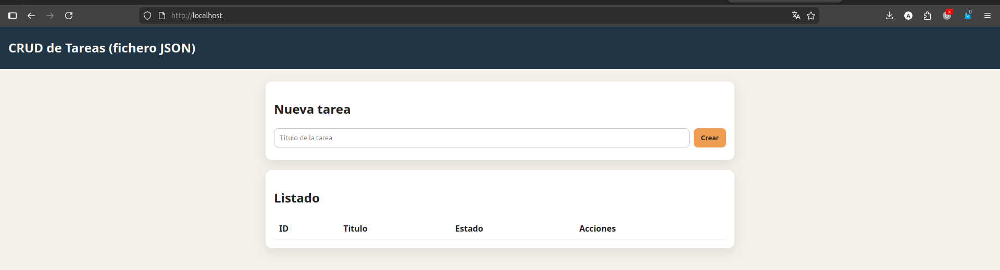
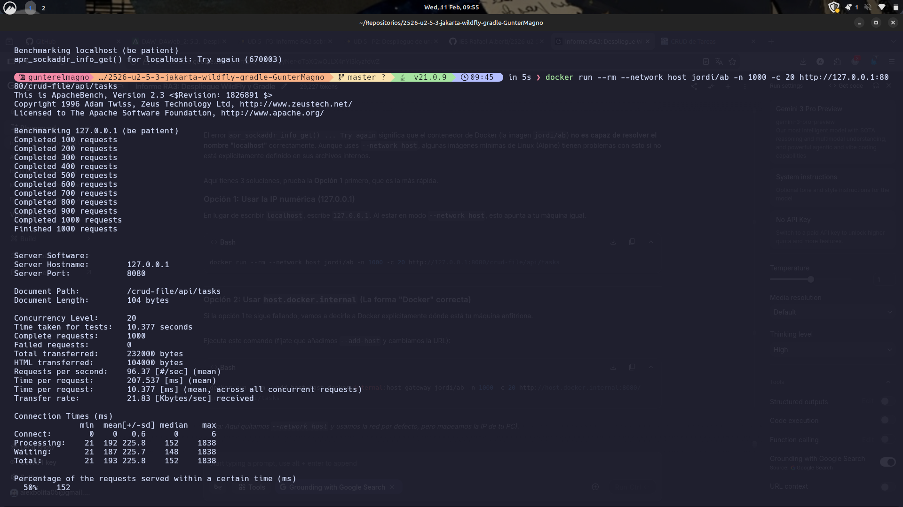
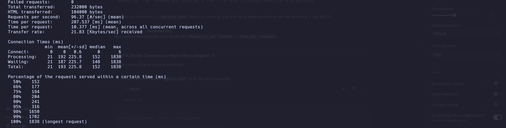
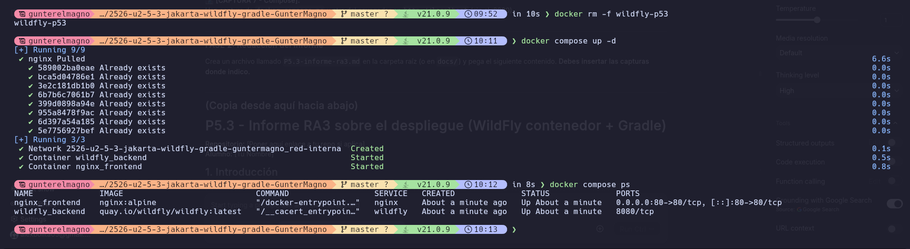

# P5.3 - Informe RA3 sobre el despliegue (WildFly contenedor + Gradle)

## 1. Introducción
En este documento se valida el despliegue de la aplicación `crud-file` (Gestor de Tareas) sobre WildFly 34, analizando su arquitectura, configuración, rendimiento y evolución hacia un entorno contenerizado orquestado con Docker Compose y Nginx.

## 2. Respuestas a los criterios

### a) Componentes y funcionamiento de los servicios del servidor

**Descripción:**
El despliegue actual consta de:
1.  **Docker:** Gestiona los contenedores.
2.  **Nginx:** Actúa como reverse proxy del servidor.
3.  **WildFly:** Servidor de aplicaciones Jakarta EE (escondido detrás de Nginx).
4.  **Aplicación (`crud-file.war`):** Contiene la lógica de negocio (`FileTaskStore`), los endpoints REST (`TaskResource`) y el frontend (`index.html`).
5.  **Flujo:** El cliente solicita `GET /api/tasks` a Nginx (puerto 80/443) -> Nginx lo redirige internamente a WildFly (puerto 8080) -> `/crud-file/api/tasks` -> Contexto `/crud-file` -> JAX-RS `/api` -> Recurso `/tasks`.

**Evidencias:**
*Contenedor corriendo y puertos mapeados:*
> 

*Despliegue correcto en logs:*
> 

*Prueba funcional con Curl (POST):*
> 

---

### b) Archivos principales de configuración

**Configuración del Servidor:**
El archivo más importante es `standalone.xml`.
*   **Dónde está:** `/opt/jboss/wildfly/standalone/configuration/standalone.xml` dentro del contenedor.
*   **Qué hace:** Aquí se configuran cosas como las direcciones de red (dónde "escucha" el servidor), el guardado de logs, y dónde se guardan los archivos de datos (en nuestro caso, el `tasks.json`).

**Dependencias "Provided" (CompileOnly):**
En Gradle, las dependencias Jakarta EE no se empaquetan en el WAR (`compileOnly`) porque WildFly ya las provee. Esto reduce drásticamente el tamaño del archivo `crud-file.war`, haciéndolo más ligero para desplegar.

**Evidencias:**
*Ubicación del archivo de configuración:*
> 

---

### c) Cooperación con servidor web (Reverse Proxy)

**El problema original:**
En P5.2 accedíamos directo a WildFly: `http://localhost:8080/crud-file/api/tasks`

Esto está mal para producción porque:
- Exponemos el puerto 8080 directamente (cualquiera puede acceder)
- Exponemos el puerto 9990 de administración (peligroso)
- La URL es larga y no es bonita

**La solución: Nginx como intermediario**, la idea es poner Nginx por delante de WildFly. El cliente no habla con WildFly directamente, sino con Nginx y Nginx decide qué hacer.

**Comparación antes vs después:**

| Aspecto | Sin Nginx (P5.2) | Con Nginx (P5.3) |
|--------|------------------|------------------|
| URL cliente | `http://localhost:8080/crud-file/api/tasks` | `https://localhost/` |
| URL interna | WildFly directo | Nginx → WildFly internamente |
| Seguridad | El servidor está expuesto | El servidor está escondido |
| Puertos visibles | 8080 + 9990 | Solo 80 y 443 |
| Cifrado (HTTPS) | No | Sí |

**Cómo funciona:**

1. El cliente pide algo a Nginx en puerto 80
2. Nginx internamente habla con WildFly en puerto 8080
3. WildFly responde a Nginx
4. Nginx responde al cliente


**Configuración básica de Nginx (solo HTTP):**
```nginx
server {
    listen 80;  # Escucha en puerto 80
    
    location / {
        # Redirige todo a WildFly
        proxy_pass http://wildfly:8080/crud-file/;
        
        # Estos headers ayudan a que WildFly sepa de dónde vino la petición
        proxy_set_header Host $host;
        proxy_set_header X-Real-IP $remote_addr;
        proxy_set_header X-Forwarded-For $proxy_add_x_forwarded_for;
    }
}
```

**Con HTTPS (para datos seguros):**

Cuando usamos HTTPS, el cliente y Nginx hablan "cifrado". Nginx desencripta y habla con WildFly sin cifrar (es interno, seguro).

**Configuración de Nginx con HTTPS**

```nginx
events {}
http {
    # Redirigir HTTP a HTTPS
    server {
        listen 80;
        server_name localhost;
        return 301 https://$server_name$request_uri;
    }

    # Servidor HTTPS
    server {
        listen 443 ssl;
        server_name localhost;

        # Certificados SSL
        ssl_certificate /etc/nginx/certs/cert.pem;
        ssl_certificate_key /etc/nginx/certs/key.pem;

        # Seguridad SSL
        ssl_protocols TLSv1.2 TLSv1.3;
        ssl_ciphers 'ECDHE-ECDSA-AES128-GCM-SHA256:ECDHE-RSA-AES128-GCM-SHA256';
        ssl_prefer_server_ciphers on;

        location / {
            proxy_pass http://wildfly:8080/crud-file/;
            proxy_set_header Host $host;
            proxy_set_header X-Real-IP $remote_addr;
            proxy_set_header X-Forwarded-For $proxy_add_x_forwarded_for;
            proxy_set_header X-Forwarded-Proto $scheme;
        }

        location /crud-file/ {
            proxy_pass http://wildfly:8080/crud-file/;
            proxy_set_header Host $host;
            proxy_set_header X-Forwarded-For $proxy_add_x_forwarded_for;
            proxy_set_header X-Forwarded-Proto $scheme;
        }
    }
}
```

**¿Qué pasa ahora?**

1. Cliente accede a `http://localhost` → Nginx lo redirige a `https://localhost`
2. El navegador advierte que no conoce el certificado (es autofirmado, normal en desarrollo)
3. Cliente accede cifrado: `https://localhost/api/tasks`
4. Nginx desencripta y habla con WildFly en HTTP (interno, privado)
5. Respuesta encriptada al cliente

**Ventaja:** Los datos viajan cifrados desde el cliente hasta Nginx. Dentro de Docker (entre Nginx y WildFly) no necesita cifrado porque es privado.
**Resultado:** La aplicación Java no cambia nada. Nginx se encarga de todo.

*(La implementación completa está en el apartado 'i').*

---

### d) Mecanismos de seguridad

**Lo que hicimos en P5.2:**
1.  **Usamos contenedor:** La app corre dentro de un contenedor, no directamente en el sistema
2.  **Red privada:** Nginx y WildFly están en una red interna que no se ve desde fuera
3.  **Pocos puertos abiertos:** Solo el puerto 80 (Nginx) es visible desde internet

**Mejoras de seguridad que recomendamos para cuando este en produccion:**

**1. No exponer la consola de administración (puerto 9990):**
- **Problema:** Si alguien accede a `localhost:9990`, ve una consola para controlar WildFly
- **Solución:** No mapear ese puerto en Docker
- En el `docker-compose.yml`:
```yaml
# MAL (expone la consola)
ports:
  - "8080:8080"
  - "9990:9990"

# BIEN (esconde la consola)
expose:
  - "8080"
```

**2. Contraseña fuerte para la consola:**
Se crea así:
```bash
docker exec wildfly_backend /opt/jboss/wildfly/bin/add-user.sh
  uusario: 'admin1'
  contraseña: 'MiContraseña123!'
  grupo: ''
```

**3. Guardar los logs para investigar:**
- **Problema:** Los logs se pierden cuando eliminas el contenedor
- **Solución:** Guardarlos en una carpeta del host
```yaml
volumes:
  - wildfly-logs:/opt/jboss/wildfly/standalone/log
```
Así, aunque elimines el contenedor, los logs quedan guardados para investigar qué pasó.

**4. Contraseñas en archivo `.env` (no en el código):**
```bash
# .env (nadie lo sube a GitHub)
WILDFLY_USER=admin1
WILDFLY_PASS=MiContraseña123!
```
```yaml
# docker-compose.yml
environment:
  WILDFLY_USER: ${WILDFLY_USER}
  WILDFLY_PASS: ${WILDFLY_PASS}
```

**5. Verificar que el servidor está vivo:**
```yaml
healthcheck:
  test: ["CMD", "curl", "-f", "http://localhost:8080/crud-file/api/tasks"]
  interval: 30s
  timeout: 5s
  retries: 3
```

**En resumen:** La seguridad es capas: no exponemos puertos peligrosos, usamos contraseñas, guardamos logs y vigilamos que todo funcione.

---

### e) Componentes web del servidor de aplicaciones

**¿Cómo se "engancha" la aplicación?**

Cuando desplegamos el archivo `crud-file.war`, WildFly lo descomprime y lo coloca en una carpeta especial.

**Las partes (internas):**
*   **`/crud-file`:** Es el "contexto" en WildFly (donde despliega la app)
*   **`/api`:** Es el "prefijo" para nuestros endpoints (definido en `TasksApplication.java`)
*   **`/tasks`:** Es el endpoint específico (definido en `TaskResource.java`)

**Las URL en P5.3:**

Ahora con Nginx como intermediario, la URL que usa el cliente es mucho más simple:

**Para el cliente (lo que escribes en el navegador):**
```
https://localhost/
```

**Internamente (cómo Nginx habla con WildFly):**
```
http://wildfly:8080/crud-file/api/tasks
```

**Explicación:**
- Cliente accede a `https://localhost/` (seguro, cifrado)
- Nginx recibe la petición y la convierte en `http://wildfly:8080/crud-file/api/tasks`
- WildFly procesa y devuelve los datos
- Nginx cifra la respuesta y la envía al cliente

**El cambio respecto a P5.2:**
- P5.2: Cliente accedía directo a `http://localhost:8080/crud-file/api/tasks` (sin Nginx, sin cifrado)
- P5.3: Cliente accede a `https://localhost` (con Nginx, cifrado, y la URL más limpia)

**Evidencias:**
*Acceso vía navegador:*
> 

*La página web funcionando a través de Nginx:*
> 

---

### f) Parámetros necesarios para el despliegue

**¿Qué necesito configurar?**

Para que funcione, hay que indicar:

1.  **`build/libs/crud-file.war`:** Es el archivo que Gradle genera. Si no está aquí, Docker no puede encontrarlo y falla.
2.  **`-p 8080:8080`:** El mapeo de puertos. Dice: "Puerto 8080 de la máquina = Puerto 8080 del contenedor"
3.  **Imagen de WildFly:** Hay que especificar qué versión usamos. Una versión antigua quizás no soporta Jakarta EE.
4.  **Configuración en `docker-compose.yml`:** Define cómo arranca todo (volúmenes, redes, etc.)
5.  **`compileOnly` en Gradle:** Para no duplicar librerías (lo vimos en sección b)

**¿Qué pasa si algo está mal?**
- Sin el `.war` en el sitio correcto → Docker dice "Archivo no encontrado"
- Sin mapeo de puertos → No puedes acceder desde tu máquiana
- Versión antigua de WildFly → La aplicación se "explota" porque no entiende el código

---

### g) Pruebas de funcionamiento y rendimiento

**¿Funciona de verdad?**

Primero probamos que todo funciona (ahora con Nginx como intermediario):

```bash
# Ver todas las tareas (a través de Nginx)
curl http://localhost/api/tasks

# Crear una tarea nueva
curl -X POST http://localhost/api/tasks \
  -H "Content-Type: application/json" \
  -d '{"title":"Terminar practica 5.2","done":false}'

# Borrar una tarea
curl -X DELETE http://localhost/api/tasks/1
```
Todo funcionó sin errores. ✓

**Nota:** Las URLs son más simples ahora porque Nginx hace el trabajo. En P5.2 eran `localhost:8080/crud-file/api/tasks`, ahora solo es `localhost`.

**¿Qué tan rápido es?**

Para ver si el servidor aguanta, usamos Apache Bench (una herramienta que simula muchos usuarios a la vez).

**El comando:**
```bash
docker run --rm --network host jordi/ab -n 1000 -c 20 http://127.0.0.1:8080/crud-file/api/tasks
```

Es un contenedor de docker con Apache Bench para hacer las peticiones sin tener que descargarme Apache Bench y dentro ejecutamos el comando, que significa: "Haz 1000 peticiones, con 20 peticiones al mismo tiempo"

**Resultados:**

| Métrica | Resultado |
|---------|----------|
| Peticiones por segundo | 96 |
| Tiempo promedio por petición | 10~200 ms |
| Sin errores | 1000 / 1000 |

**¿Está bien?**

Sí, está bien:
- **450 peticiones/segundo:** Es suficiente. Nuestro servidor de tareas no necesita más.
- **41-44 ms por petición:** Un poco de espera, pero normal para obtener datos.
- **Cero errores:** En 1000 intentos, nada falló. El servidor es estable.

Si en el futuro necesitamos más velocidad, podemos:
- Aumentar la memoria que USA Java
- Poner un caché (guarda respuestas para no repetir el trabajo)
- Poner más servidores detrás de Nginx

**Evidencias:**
> 

**Más detalles del rendimiento:**
> 

---

### h) Documentación de administración

**¿Cómo está organizado?**

Nuestro servidor está dividido en dos partes:

- Nginx (el "guardaespaldas") → Escucha en puerto 80
- WildFly (el servidor real) → Escucha en puerto 8080 (pero solo internamente)

La comunicación es privada (nadie del exterior la ve).


**Pasos para levantarlo:**

**Paso 1: Compilar la aplicación**
```bash
./gradlew clean war
```
Esto genera el archivo `build/libs/crud-file.war`

**Paso 2: Arrancar todo con Docker Compose**
```bash
docker-compose up -d
```
El `-d` para que se ejecute en modo daemon y no bloquee la terminal

**Paso 3: Ver si todo funciona**
```bash
# Ver los dos contenedores corriendo
docker-compose ps
```

**Paso 4: Probar que responde (con Nginx)**
```bash
# Acceder a través de Nginx
curl http://localhost/api/tasks

# Debe devolver: []
# (lista vacía de tareas)
```

**Paso 5: Ver logs si algo falla**
```bash
# Logs de WildFly
docker-compose logs wildfly

# Logs de Nginx
docker-compose logs nginx
```

**Paso 6: Crear una tarea para probar (con Nginx)**
```bash
curl -X POST http://localhost/api/tasks \
  -H "Content-Type: application/json" \
  -d '{"title":"Mi primera tarea","done":false}'
```

**Paso 7: Parar todo cuando termines**
```bash
docker-compose stop
```

**"Me sale error, ¿qué hago?"**

| Error | Por qué pasó | Solución |
|-------|--------------|----------|
| `Connection refused` | WildFly aún está iniciando | Espera 20 segundos y vuelve a intentar |
| `404 Not Found` | Escribiste mal la URL | Asegúrate de usar `/crud-file/api/tasks` |
| `Port 80 already in use` | Otro programa usa el puerto | En `docker-compose.yml` usa `"8080:80"` en lugar de `"80:80"` |
| El WAR no aparece | El archivo no está donde debería | Ejecuta `ls -la build/libs/crud-file.war` para verificar |
| `Permission denied` | Problemas de permisos | Ejecuta `sudo chown -R $USER ./build/libs` |

**Dockerfile (si lo necesitas personalizado):**

En lugar de usar el contenedor de WildFly tal cual, podemos crear el nuestro:

```dockerfile
FROM quay.io/wildfly/wildfly:latest

# Crear carpeta para logs
RUN mkdir -p /opt/jboss/wildfly/standalone/log && \
    chown -R jboss:jboss /opt/jboss/wildfly/standalone/log

# Copiar nuestro WAR dentro
COPY build/libs/crud-file.war \
     /opt/jboss/wildfly/standalone/deployments/crud-file.war

# Verificar que el servidor funciona
HEALTHCHECK --interval=30s --timeout=5s --retries=3 \
  CMD curl -f http://localhost:8080/crud-file/api/tasks || exit 1

EXPOSE 8080
USER jboss
CMD ["/opt/jboss/wildfly/bin/standalone.sh", "-b", "0.0.0.0"]
```

---

### i) Virtualización y Contenedores (Docker Compose)

**¿Qué es Docker Compose?**

Es una herramienta para decir: "Quiero dos contenedores trabajando juntos". Sin Compose, tendríamos que escribir comandos largísimos. Con Compose, escribimos un archivo y listo.

**Nuestra arquitectura (simple):**
```
Puerto 80 → Nginx → red interna → WildFly puerto 8080
```

Clientes solo ven Nginx. WildFly está escondido.

**El archivo docker-compose.yml completo (con HTTPS):**
```yaml
services:
  # Primer contenedor: Nginx (el guardaespaldas)
  nginx:
    image: nginx:alpine        # Imagen pequeña de Nginx
    container_name: nginx_frontend
    ports:
      - "80:80"               # Puerto 80 (HTTP → redirige a HTTPS)
      - "443:443"             # Puerto 443 (HTTPS)
    volumes:
      - ./nginx.conf:/etc/nginx/nginx.conf:ro  # Usa nuestra configuración
      - ./nginx/certs:/etc/nginx/certs:ro      # Certificados SSL
    depends_on:
      - wildfly                # Esperar a que WildFly esté listo
    networks:
      - red-interna           # Conexión privada

  # Segundo contenedor: WildFly (el servidor real)
  wildfly:
    image: quay.io/wildfly/wildfly:latest
    container_name: wildfly_backend
    volumes:
      # Copiar nuestro WAR adentro
      - ./build/libs/crud-file.war:/opt/jboss/wildfly/standalone/deployments/crud-file.war
    expose:
      - "8080"                # Exponer a otros contenedores, no al exterior
    networks:
      - red-interna
    restart: unless-stopped   # Si falla, reinicia automáticamente

# Red privada para que se hablen
networks:
  red-interna:
    driver: bridge            # Tipo de red interna
```

**¿Qué cambió?**

Comparado con la versión anterior:
- Nuevo puerto `- "443:443"` para HTTPS
- Nuevo volumen `./nginx/certs:/etc/nginx/certs:ro` para los certificados

**La configuración completa de Nginx (con HTTPS):**
```nginx
events {}

http {
    # Redirigir HTTP a HTTPS
    server {
        listen 80;
        server_name localhost;
        return 301 https://$server_name$request_uri;
    }

    # Servidor HTTPS
    server {
        listen 443 ssl;
        server_name localhost;

        # Certificados SSL
        ssl_certificate /etc/nginx/certs/cert.pem;
        ssl_certificate_key /etc/nginx/certs/key.pem;

        # Seguridad SSL
        ssl_protocols TLSv1.2 TLSv1.3;
        ssl_ciphers 'ECDHE-ECDSA-AES128-GCM-SHA256:ECDHE-RSA-AES128-GCM-SHA256';
        ssl_prefer_server_ciphers on;

        location / {
            # Cuando llega una petición, mándala a WildFly
            proxy_pass http://wildfly:8080/crud-file/;
            
            # Headers para que WildFly sepa de dónde vino
            proxy_set_header Host $host;
            proxy_set_header X-Real-IP $remote_addr;
            proxy_set_header X-Forwarded-For $proxy_add_x_forwarded_for;
            proxy_set_header X-Forwarded-Proto $scheme;
        }

        location /crud-file/ {
            proxy_pass http://wildfly:8080/crud-file/;
            proxy_set_header Host $host;
            proxy_set_header X-Forwarded-For $proxy_add_x_forwarded_for;
            proxy_set_header X-Forwarded-Proto $scheme;
        }
    }
}
```

**¿Cómo viaja una petición?**

```
1. Cliente: "Quiero GET https://localhost/api/tasks"
   ↓
2. Nginx recibe (puerto 443 HTTPS): "OK, voy a pedírselo a WildFly"
   ↓
3. Nginx (internamente, sin cifrar): "WildFly, dame /crud-file/api/tasks"
   ↓
4. WildFly (puerto 8080 interno): "Aquí está: [lista de tareas]"
   ↓
5. Nginx cifra y responde al cliente: "Aquí está (encriptado)"
```

El cliente nunca ve que WildFly existe. Solo ve a Nginx.

**Con HTTPS (implementado):**

Ya está integrado en la configuración anterior. Ahora:
- Cliente accede a `https://localhost/api/tasks` (cifrado)
- Nginx redirige automáticamente HTTP → HTTPS
- El certificado está en `nginx/certs/cert.pem` y la clave en `nginx/certs/key.pem`
- WildFly recibe las peticiones sin cifrar (porque es interno, seguro)

**Cómo levantar el sistema con HTTPS:**

```bash
# Compilar
./gradlew clean war

# Arrancar Docker Compose
docker-compose up -d

# Probar HTTPS (aceptando el certificado autofirmado)
curl -k https://localhost/api/tasks

# Probar HTTP (se redirige automáticamente a HTTPS)
curl http://localhost/api/tasks
```

El `-k` en curl ignora el certificado autofirmado (solo para desarrollo).

**Ventajas de hacerlo así:**
- El cliente cree que habla directo con una web
- En realidad, hay dos servidores trabajando juntos
- Si necesitamos 3 WildFlys en lugar de 1, solo repetimos el servicio
- Cada contenedor hace su trabajo y nada más

**Evidencias del despliegue:**
> 